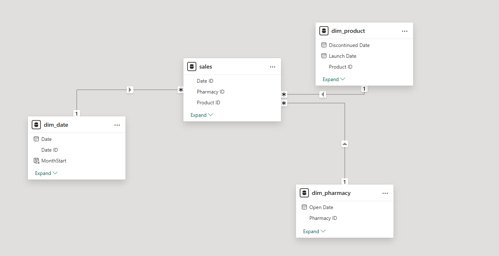
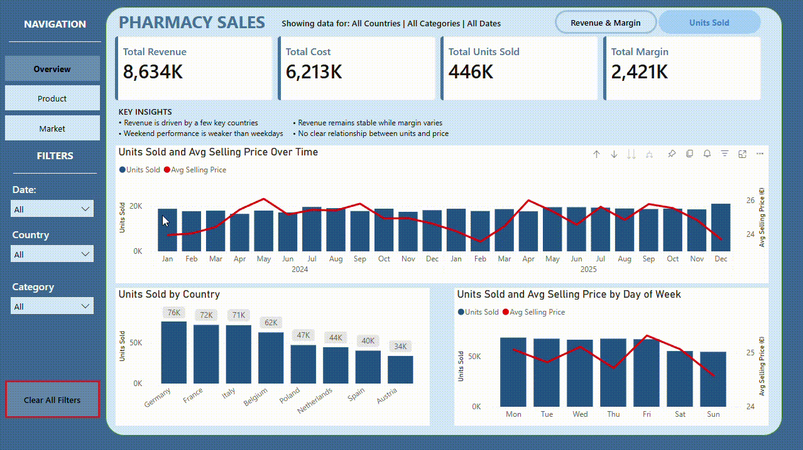
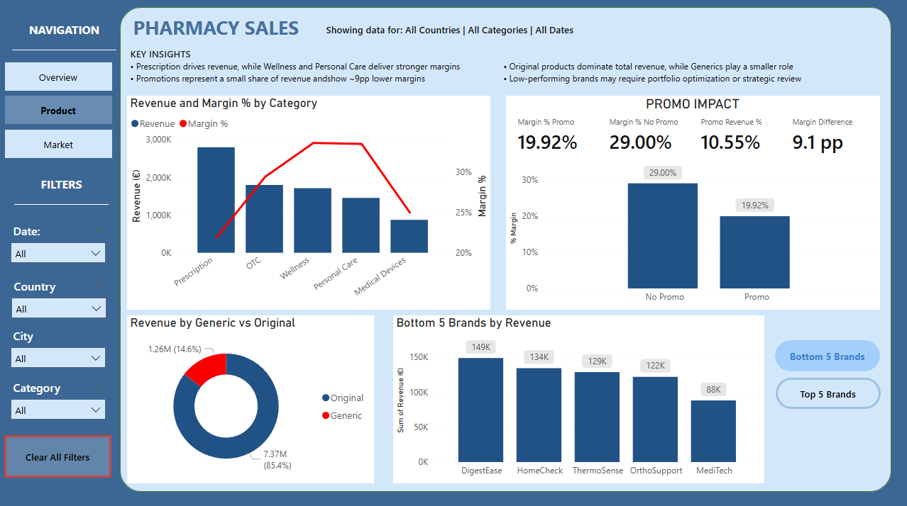
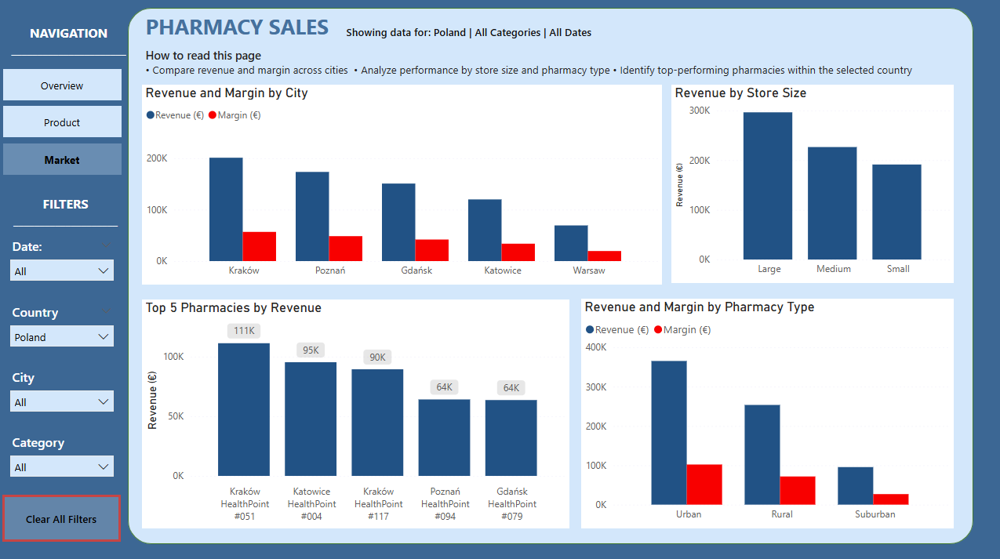

# Pharmacy Sales Analysis
## Table of Contents

- [Project Overview](#project-overview)
- [Dataset](#dataset)
- [Tools](#tools)
- [Dashboard Pages](#dashboard-pages)
- [SQL Validation](#sql-validation)
- [Key Insights](#key-insights)
- [Business Recommendations](#business-recommendations)
  
## Project overview
This project analyzes pharmacy sales performance across multiple contries, cities, product categories and pharmacy types using SQL and Power BI.

**The dashobard focuses on:**
-Revenue and margin analysis over time
-Units sold and average selling price analysis over time
-Promotion performance
-Brands and products performance
-Country and city-level comparision
-Performance od different types of pharmacy

## Dataset

The dataset was sourced from [Kaggle](https://www.kaggle.com/datasets/ehmadali/eu-pharmacy-products-and-pricing).
The original data was provided in Excel format and converted to SQL database.
Due to file size limitations, the raw dataset is not included in this repository.

The dataset follows a classic star schema with 1 fact table and 3 dimension tables.

### Data Model

## Tools:
- SQL (PostgreSQL)
- Power BI 
- DAX
- Data Modeling

## Dashboard Pages
- 
- 
- 
- 

## SQL Validation
  SQL validation queries were used to verify:
- KPI consistency,
- Power BI filter logic,
- dashboard calculations
  
  All data quality checks returned valid results:
- no duplicates,
- no orphan keys,
- no negative revenue/cost values,
- consistent margin calculations.

## Key insights
 
- Revenue is driven by a few key countries, namely Germany, France, Italy and Belgium.
- Revenue remains relatively stable over time, while profit margins fluctuate significantly between periods.
- Weekend sales performance is weaker than weekdays.
- There is no clear relationship between units sold and price.
- Prescription products generate the highest revenue, while Wellness and Personal Care categories achieve higher profit margins.
- Promotional sales account for a relatively small share of revenue and are associated with approximately 9 percentage points lower margins.
- Original branded products dominate total revenue, while generic products contribute a smaller market share.
- Large and urban pharmacies generally outperform smaller and rural locations in both revenue and margin performance.			

## Business Recommendations
- Optimize promotional strategies to improve both revenue contribution and margin performance from promotional sales.
- Increase focus on high-margin categories such as Wellness and Personal Care to improve overall profitability.
- Consider targeted weekend campaigns to increase weekend sales performance
- Investigate the reason behind the significantly lower performance of rural and smaller pharmacies and expand successful practices used by large and urban pharmacies where possible.

